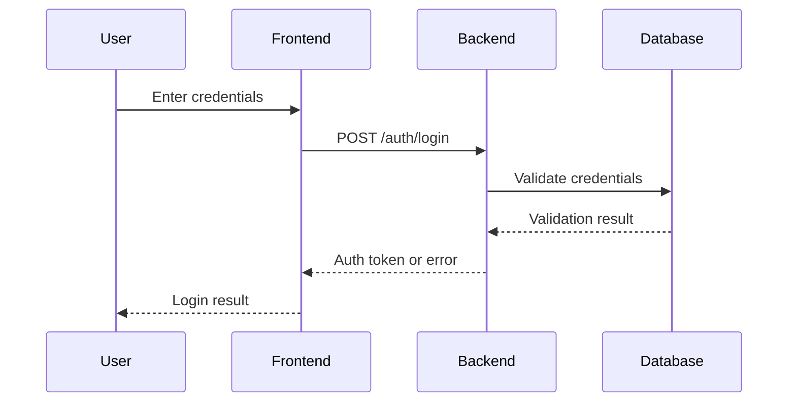

# Dokumentationsrichtlinien

Diese Richtlinien dienen dazu, eine konsistente und qualitativ hochwertige Dokumentation im IdeaValidator-Projekt zu gewährleisten.

## Übersicht der Dokumentationsstruktur

- `/docs/architecture/`: Architekturdiagramme und -dokumentation
  - `/component/`: Komponentendiagramme (Systemübersicht)
  - `/workflow/`: Ablaufdiagramme (User Flows, Prozesse)
  - `/database/`: ER-Diagramme und Datenbankdokumentation
  - `/sequence/`: Sequenzdiagramme (API-Interaktionen, Systemkomponenten)
- `/docs/api/`: API-Dokumentation
- `/docs/user/`: Benutzerhandbücher
- `/docs/dev/`: Entwicklerdokumentation

## Richtlinien zur Dokumentationspflege

### Wann dokumentieren?

- **Bei neuen Features**: Jede neue Funktionalität muss dokumentiert werden
- **Bei Architekturänderungen**: Aktualisierung bestehender Diagramme oder Erstellung neuer
- **Bei API-Änderungen**: Anpassung der API-Dokumentation
- **Bei UI-Änderungen**: Aktualisierung der Benutzerhandbücher bei relevanten Änderungen

### Diagramme

- Alle Diagramme werden in [Mermaid](https://mermaid-js.github.io/mermaid/#/) erstellt
- Diagramme werden als Markdown-Dateien gespeichert (`.md`) und enthalten den Mermaid-Code
- Pro Diagramm sollte es eine kurze textuelle Erklärung geben
- Dateinamen sollten aussagekräftig sein (z.B. `user-authentication-flow.md`)

#### Beispiel für ein Mermaid-Diagramm:

```markdown
# Benutzerauthentifizierung

Dieses Sequenzdiagramm zeigt den Authentifizierungsprozess für Benutzer.


```

### Code-Dokumentation

- Öffentliche Funktionen, Klassen und Module immer dokumentieren
- Komplexe Algorithmen oder Logik detailliert erklären
- Dokumentation in der gleichen Sprache wie der Code (Englisch)
- JSDoc/TSDoc für JavaScript/TypeScript verwenden

### Kontinuierliche Pflege

- Dokumentation sollte Teil des Feature-Entwicklungsprozesses sein, nicht nachträglich
- Regelmäßige Überprüfung der Dokumentation auf Aktualität (alle 2-3 Monate)
- Bei Entdeckung veralteter Dokumentation, direkt aktualisieren oder ein Issue erstellen

## Prozess für Dokumentationsänderungen

1. **Prüfen**: Identifiziere, welche Dokumentation aktualisiert werden muss
2. **Aktualisieren**: Ändere oder erstelle die entsprechenden Dokumente
3. **Review**: Lass die Änderungen von einem Teammitglied überprüfen
4. **Veröffentlichen**: Commite die Änderungen mit einem beschreibenden Commit-Message

## Verantwortlichkeiten

- Jeder Entwickler ist für die Dokumentation seiner eigenen Änderungen verantwortlich
- Die Vollständigkeit der Dokumentation wird im PR-Prozess überprüft
- Bei größeren Dokumentationsaufgaben können dedizierte Issues erstellt werden 