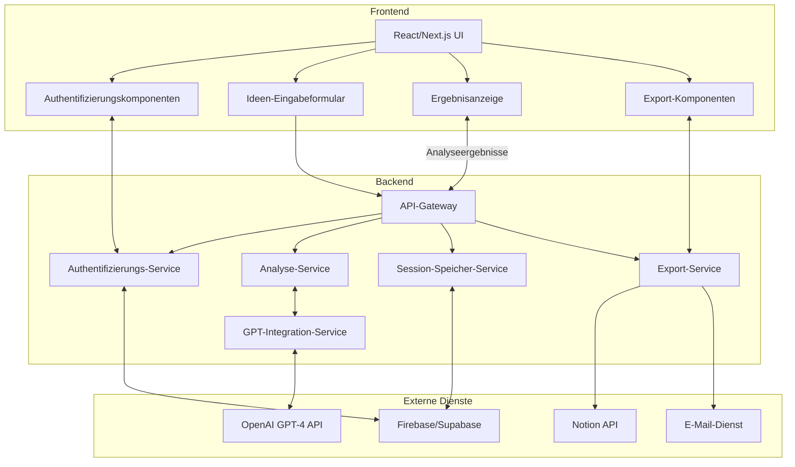

# Systemarchitektur - Komponentendiagramm

Dieses Diagramm visualisiert die Hauptkomponenten der IdeaValidator-Anwendung und deren Beziehungen zueinander.

## Komponenten-Übersicht

## Hauptkomponenten

### Frontend
- **React/Next.js UI**: Die Hauptbenutzeroberfläche, die alle Frontend-Komponenten integriert
- **Authentifizierungskomponenten**: Login, Registrierung und Nutzerverwaltung
- **Ideen-Eingabeformular**: Formulare zur Eingabe und Validierung von Geschäftsideen
- **Ergebnisanzeige**: Komponenten für die Darstellung der Analyseresultate
- **Export-Komponenten**: UI-Elemente für den Export von Ergebnissen

### Backend
- **API-Gateway**: Zentrale Schnittstelle für alle Client-Anfragen
- **Authentifizierungs-Service**: Verwaltet Benutzerauthentifizierung und -autorisierung
- **Analyse-Service**: Koordiniert die verschiedenen Analysetypen
- **GPT-Integration-Service**: Verwaltet die Kommunikation mit der OpenAI API
- **Session-Speicher-Service**: Speichert und lädt Analyse-Sessions
- **Export-Service**: Generiert und verwaltet Exporte (PDF, Notion, E-Mail)

### Externe Dienste
- **OpenAI GPT-4 API**: Liefert AI-basierte Analyse von Geschäftsideen
- **Firebase/Supabase**: Datenbank und Authentifizierung
- **Notion API**: Integration für Notion-Exporte
- **E-Mail-Dienst**: Service für den E-Mail-Versand (SendGrid, Mailgun, etc.)

## Datenfluss

1. Benutzer interagieren mit der Frontend-Oberfläche
2. Authentifizierungsanfragen werden über den Auth-Service abgewickelt
3. Analyseanfragen werden vom API-Gateway an den Analysis-Service weitergeleitet
4. Der GPT-Service kommuniziert mit der OpenAI API
5. Sitzungsdaten werden in Firebase/Supabase gespeichert
6. Exportanfragen werden vom Export-Service verarbeitet
7. Ergebnisse werden an das Frontend zurückgegeben und angezeigt 