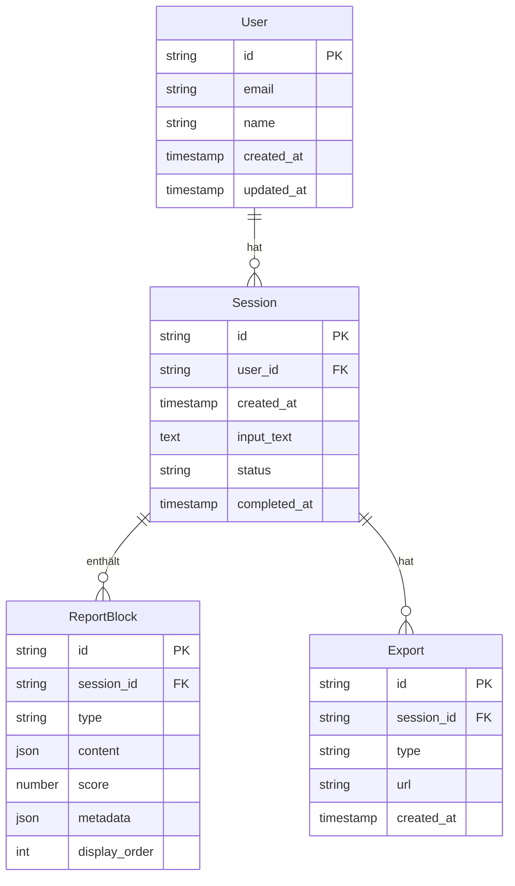

# Datenbankstruktur - ER-Diagramm

Dieses Diagramm visualisiert die Datenbankstruktur des IdeaValidator-Systems mit den wichtigsten Entitäten und deren Beziehungen.

## Entities und Relationen

## Entity-Beschreibungen

### User
- **id**: Eindeutige Benutzer-ID
- **email**: E-Mail-Adresse des Benutzers (für Authentifizierung)
- **name**: Name des Benutzers
- **created_at**: Zeitpunkt der Kontoerstellung
- **updated_at**: Zeitpunkt der letzten Aktualisierung

### Session
- **id**: Eindeutige Sessions-ID
- **user_id**: Referenz zum Benutzer (kann null sein für anonyme Sessions)
- **created_at**: Zeitpunkt der Sessionerstellung
- **input_text**: Die eingegebene Geschäftsidee als Text
- **status**: Status der Session (pending, processing, completed, error)
- **completed_at**: Zeitpunkt der Fertigstellung

### ReportBlock
- **id**: Eindeutige Block-ID
- **session_id**: Referenz zur zugehörigen Session
- **type**: Typ des Blocks (scorecard, swot, mvp, risk, role_feedback)
- **content**: Inhalt des Blocks als JSON-Objekt
- **score**: Numerische Bewertung (falls vorhanden)
- **metadata**: Zusätzliche Metadaten als JSON-Objekt
- **display_order**: Reihenfolge für die Anzeige

### Export
- **id**: Eindeutige Export-ID
- **session_id**: Referenz zur zugehörigen Session
- **type**: Typ des Exports (pdf, notion, email)
- **url**: URL zum exportierten Dokument (wenn vorhanden)
- **created_at**: Zeitpunkt der Erstellung des Exports

## Beziehungen

1. Ein **User** kann mehrere **Sessions** haben (1:n)
2. Eine **Session** enthält mehrere **ReportBlocks** (1:n)
3. Eine **Session** kann mehrere **Exports** haben (1:n)

## Indizes und Constraints

- Primary Keys auf allen ID-Feldern
- Foreign Key Constraints für Referenzintegrität
- Indizes auf:
  - User.email (unique)
  - Session.user_id (für schnelle Benutzerabfragen)
  - ReportBlock.session_id (für schnelle Session-Abfragen)
  - Export.session_id (für schnelle Session-Abfragen)
  - Session.status (für Statusfilterung) 