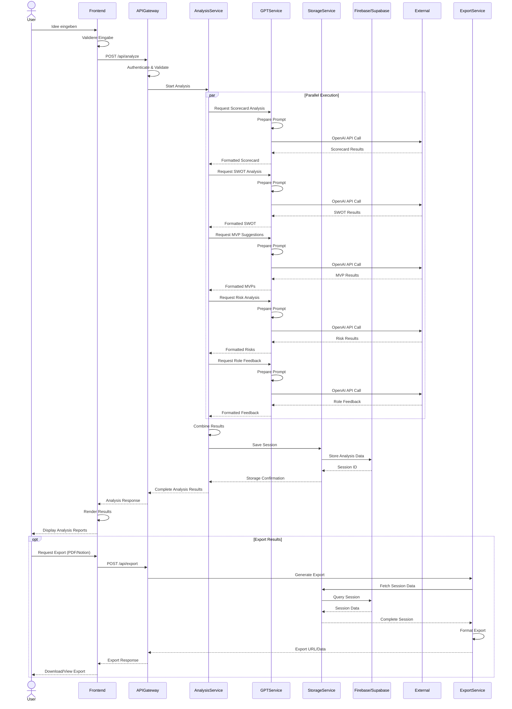

# Sequenzdiagramm: Ideenanalyse-Prozess

Dieses Sequenzdiagramm zeigt die detaillierte Interaktion zwischen den Systemkomponenten während einer Ideenanalyse.

## Prozessbeschreibung

1. **Initiierung**
   - Der Benutzer gibt seine Geschäftsidee im Frontend ein
   - Das Frontend validiert die Eingabe lokal
   - Die Anfrage wird an den API Gateway gesendet

2. **Analyse-Orchestrierung**
   - Der Analysis Service koordiniert mehrere parallele GPT-Anfragen
   - Jede Analyse (Scorecard, SWOT, MVP, Risiko, Rollen) läuft in einem eigenen Prozess
   - Das GPT Service bereitet spezifische Prompts für jede Analyse vor
   - Die Anfragen werden an die OpenAI API gesendet
   - Die Ergebnisse werden formatiert und strukturiert

3. **Speicherung**
   - Der Analysis Service kombiniert alle Ergebnisse
   - Der Storage Service speichert die Sitzung in der Datenbank
   - Die Session ID wird zurückgegeben

4. **Darstellung**
   - Die Ergebnisse werden an das Frontend übermittelt
   - Das Frontend rendert die verschiedenen Analysekomponenten
   - Der Benutzer sieht die vollständige Analyse

5. **Export (optional)**
   - Der Benutzer kann die Ergebnisse exportieren (PDF, Notion)
   - Der Export Service generiert das entsprechende Format
   - Das Ergebnis wird zum Download oder zur Anzeige bereitgestellt

## Fehlerbehandlung (nicht dargestellt)

- Timeouts bei API-Aufrufen werden mit Retry-Mechanismen behandelt
- Bei GPT-API-Fehlern werden Fallback-Optionen verwendet
- Datenbankfehler werden protokolliert und dem Benutzer mitgeteilt 