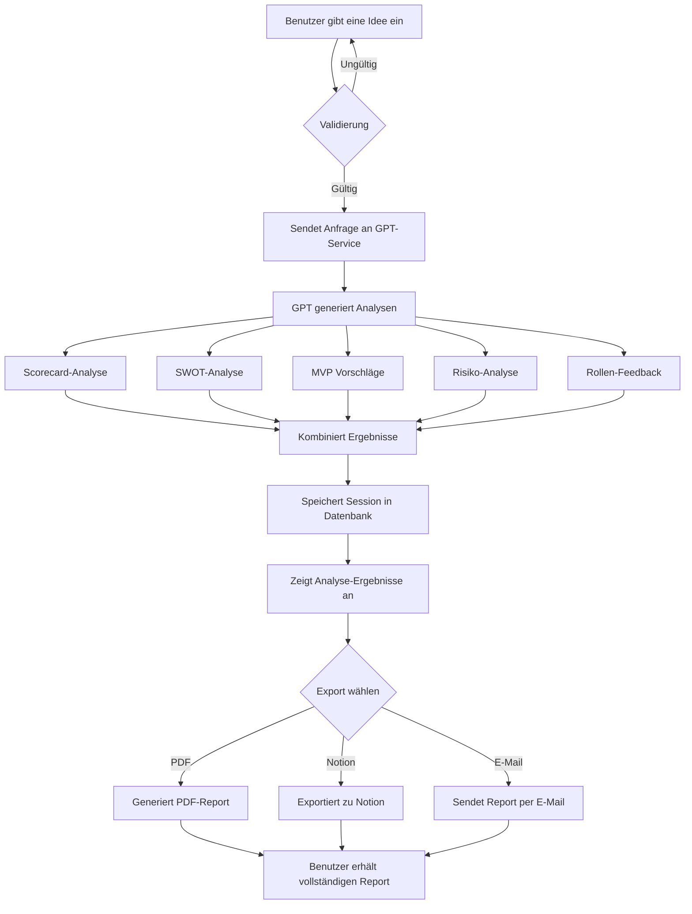

# Ideen-Analyse Workflow

Dieser Workflow zeigt den Prozess der Ideen-Eingabe, Analyse und Report-Generierung in der IdeaValidator-Anwendung.

## Workflow-Diagramm

## Prozess-Beschreibung

1. **Ideen-Eingabe**: Der Benutzer gibt eine Geschäftsidee oder ein Konzept in das Textfeld ein.
2. **Validierung**: Das System prüft, ob die Eingabe den Mindestanforderungen entspricht.
3. **GPT-Analyse**: Die validierte Eingabe wird an den GPT-Service gesendet.
4. **Analyse-Generierung**: Das System generiert parallel verschiedene Analysetypen:
   - Scorecard-Analyse (10 Kategorien mit Bewertungen 0-10)
   - SWOT-Analyse (Stärken, Schwächen, Chancen, Risiken)
   - MVP-Vorschläge und Validierungs-Roadmap
   - Risiko-Analyse mit Wahrscheinlichkeiten und Gegenmaßnahmen
   - Rollen-basiertes Feedback ("If I were you...")
5. **Ergebnis-Aggregation**: Alle Analysen werden zu einem Gesamtbericht zusammengeführt.
6. **Daten-Speicherung**: Die Session wird in der Datenbank gespeichert.
7. **Ergebnis-Anzeige**: Die Analyse wird dem Benutzer angezeigt.
8. **Export-Optionen**: Der Benutzer kann den Bericht exportieren:
   - Als PDF-Dokument
   - In eine Notion-Vorlage
   - Per E-Mail an sich selbst oder andere

## Technische Interaktionen

- Frontend sendet API-Anfragen an Backend-Services
- Backend kommuniziert mit OpenAI GPT-API
- Ergebnisse werden in Firebase/Supabase gespeichert
- PDF-Generierung erfolgt serverseitig
- Notion-Export nutzt die Notion API
- E-Mail-Versand erfolgt über einen E-Mail-Dienst (SendGrid, etc.) 